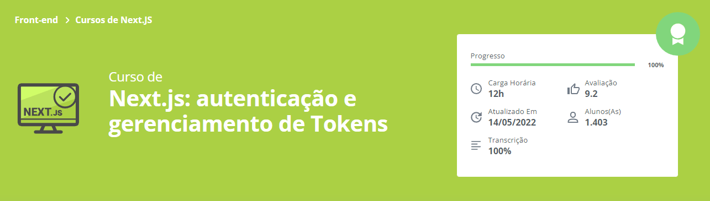

<h1 align="center">
  
</h1>
<h2 align="center">
  Next.js: autenticação e gerenciamento de Tokens
</h2>

### 📃 Sobre
Aplicação simples para implementação de autenticação com JWT em NextJS, funcionalidades como Refresh Token e Access Token, fluxo de login e logout. Compreendimento de boas práticas para evitar vulnerabilidades.

### 🛠️ Rodando o projeto

```bash
## Clone o projeto ao todo
$ git clone https://github.com/wesanjos/alura-estudos.git

## Acessa a pasta do projeto 
$ cd alura-estudos/next-3-jwt

## Instale as dependências do front-end
$ cd frontend
$ yarn install ou npm install

## Executa aplicação front-end
$ yarn dev ou npm run dev

## Para funcionamento completo é necessário iniciar o backend
## Instale as dependências do back-end
$ cd backend
$ yarn install ou npm install

## Executa aplicação back-end
$ yarn dev ou npm run dev

## Servidor será iniciado no seguinte endereço: http://localhost:3000
## Caso deseje visualizar API do backend, só acessar http://localhost:4000
```

## 📌 Tecnologias 
- [NextJS](https://nextjs.org/)
- [JWT](https://jwt.io/)
