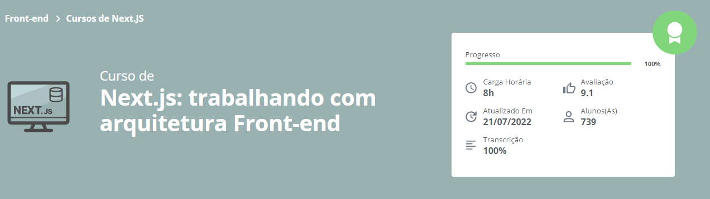

<h1 align="center">
  
</h1>
<h2 align="center">
  Next.js: trabalhando com arquitetura Front-end
</h2>

### 📃 Sobre
Construido uma arquitetura front-end moderna, onde foi utilizado de mono-repos, testes e dicas de uma boa utilização com github.
No mono-repo foi criado estrutura pra Design System, pasta para Web, Setup com Testes, ESLint, Typescript e NextJS.

### 🛠️ Rodando o projeto

```bash
## Clone o projeto ao todo
$ git clone https://github.com/wesanjos/alura-estudos.git

## Acessa a pasta do projeto 
$ cd alura-estudos/next-arquitetura

## Instale as dependências
$ yarn install ou npm install

## Executa aplicação como desenvolvimento
$ yarn dev:web-public ou npm run dev:web-public

## Realizando teste no projeto ao todo
$ yarn test ou npm run test 

## Possibilidade de testar somente web-public, design-system e utils (Só realizar a troca do nome)
$ yarn test:web-public ou npm run test:web-public

## Servidor será iniciado no seguinte endereço: http://localhost:3000
```

## 📌 Tecnologias 
- [NextJS](https://nextjs.org/)
- [Typescript](https://www.typescriptlang.org/)
- [Jest](https://jestjs.io/pt-BR/)
- [Styled-Components](https://styled-components.com/)
