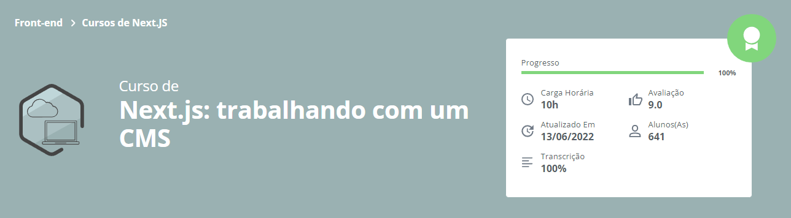

<h1 align="center">
  
</h1>
<h2 align="center">
  Next.js: trabalhando com um CMS
</h2>

### 📃 Sobre
Realizado a integração de um CMS (DatoCMS) em uma página estática criada com NextJS. 
Desenvolvimento com boas práticas para deixar todo conteúdo de forma dinâmica e com funcionalidade de preview.

### 🛠️ Rodando o projeto

```bash

## Clone o projeto ao todo
$ git clone https://github.com/wesanjos/alura-estudos.git

## Acessa a pasta do projeto 
$ cd alura-estudos/next-cms

## Instale as dependências
$ yarn install ou npm install

## Executa aplicação como desenvolvimento
$ yarn dev ou npm run dev

## Servidor será iniciado no seguinte endereço: http://localhost:3000

## O CMS já está integrado e funcional, só não é possível realizar alterações

```

## 📌 Tecnologias 
- [NextJS](https://nextjs.org/)
- [DatoCMS](https://www.datocms.com/)
- [Styled-Components](https://styled-components.com/)
- [Lodash](https://lodash.com/)
