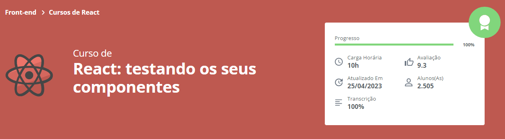

<h1 align="center">
  
</h1>
<h2 align="center">
  React: Testando os seus componentes
</h2>

### 📃 Sobre
Foi desenvolvido uma aplicação web de "Amigo Secreto", é realizado o cadastro dos participantes e efetuado o sorteio de quem será o amigo secreto.

### 🛠️ Rodando o projeto

```bash

## Clone o projeto ao todo
$ git clone https://github.com/wesanjos/alura-estudos.git

## Acessa a pasta do projeto 
$ cd alura-estudos/react-tests

## Intale as dependências
$ yarn install ou npm install

## Executa aplicação como desenvolvimento
$ yarn dev ou npm run dev

## Caso deseje executar os testes
$ yarn test ou npm run test

## Servidor será iniciado no seguinte endereço: http://localhost:3000

```

## 📌 Tecnologias 
- [React](https://reactjs.org)
- [TypeScript](https://www.typescriptlang.org/)
